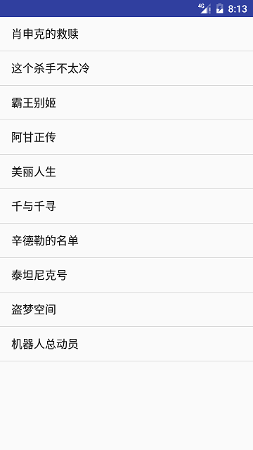

# Demo地址 #
[RxJava2Demo](RxJava2Demo)

本Demo旨在帮助从未接触过RxJava的同学直接入坑RxJava2，如丝般顺滑，千山万水总是情，留个star行不行？

# RxJava & RxAndroid （2.0版）#

## 定义 ##
>RxJava – Reactive Extensions for the JVM – a library for composing asynchronous and event-based programs using observable sequences for the Java VM.

>一个在 Java VM 上使用可观测的序列来组成异步的、基于事件的程序的库

初学者如果看到这个准确但晦涩的定义肯定一脸懵逼，不过我们我们只要把握重点即可：

* 异步
* 基于事件
* 观察者模式

>RxAndroid - Android specific bindings for RxJava 2.This module adds the minimum classes to RxJava that make writing reactive components in Android applications easy and hassle-free.
>
> RxAndroid在RxJava的基础上添加了最少的类使得开发Android应用中的响应式组件更加的容易和自由

## 特点 ##
简洁，并不是指代码量上的那种简洁，而是逻辑上的简洁，随着程序逻辑变得越来越复杂，它依然能够保持简洁。

## Github ##
* [RxJava](https://github.com/ReactiveX/RxJava)
* [RxAndroid](https://github.com/ReactiveX/RxAndroid)

# Hello world #
## 添加依赖 ##
	compile 'io.reactivex.rxjava2:rxandroid:2.0.1'
	compile 'io.reactivex.rxjava2:rxjava:2.0.1'

## 简单版本 ##
    
    //简单版本
    private void helloWorldSimple() {
        //创建消费者，消费者接受一个String类型的事件
        Consumer<String> consumer = new Consumer<String>() {
            @Override
            public void accept(String s) throws Exception {
                Log.d(TAG, s);
            }
        };
        //被观察者发出Hello World, 并且指定该事件的消费者为consumer
        Observable.just("Hello World").subscribe(consumer);
    }

### 运行结果 ###
	D/MainActivity: Hello World

## 复杂版本 ##

    private void helloWorldComplex() {
		//Observer可以看做Consumer的完整版
        Observer<String> observer = new Observer<String>() {

            //当Observable调用subscribe方法时会回调该方法
            @Override
            public void onSubscribe(Disposable d) {
                Log.d(TAG, "onSubscribe: ");
            }

            //onSubscribe方法后调用
            @Override
            public void onNext(String value) {
                Log.d(TAG, "onNext: " + value);
            }
            //这里没有出错，没有被调用
            @Override
            public void onError(Throwable e) {
                Log.d(TAG, "onError: ");
            }

            //onNext之后调用
            @Override
            public void onComplete() {
                Log.d(TAG, "onComplete: ");
            }
        };
        //被观察者发出Hello World, 并且指定该事件的观察者为observer
        Observable.just("Hello World").subscribe(observer);
    }

### 运行结果 ###
	D/MainActivity: onSubscribe: 
	D/MainActivity: onNext: Hello World
	D/MainActivity: onComplete: 

## 变态版本 ##
    private void helloWorldPlus() {
        //创建一个观察者
        Observer<String> observer = new Observer<String>() {

            //当Observable调用subscribe方法时会回调该方法
            @Override
            public void onSubscribe(Disposable d) {
                Log.d(TAG, "onSubscribe: ");
            }

            //onSubscribe方法后调用
            @Override
            public void onNext(String value) {
                Log.d(TAG, "onNext: " + value);
            }
            //这里没有出错，没有被调用
            @Override
            public void onError(Throwable e) {
                Log.d(TAG, "onError: ");
            }

            //onNext之后调用
            @Override
            public void onComplete() {
                Log.d(TAG, "onComplete: ");
            }
        };
		
		//创建一个Observable
        Observable<String> observable = Observable.create(new ObservableOnSubscribe<String>() {

            @Override
            public void subscribe(ObservableEmitter<String> e) throws Exception {
                e.onNext("Hello World");//会调用到观察者的onNext
                e.onComplete();//会调用到观察者的onComplete
            }
        });

        observable.subscribe(observer);
    }

### 运行结果 ###
	D/MainActivity: onSubscribe: 
	D/MainActivity: onNext: Hello World
	D/MainActivity: onComplete: 

# filter操作符 #
你早上去吃早餐，师傅是被观察者，说咱这有包子，馒头，肠粉，春卷，饺子，炒粉，你仔细想了想，发现你是最喜欢饺子的，所以把其他的都排除掉，
于是你就吃到了饺子。

    private void filter() {
        //把Consumer可以看做精简版的Observer
        Consumer<String> consumer = new Consumer<String>() {
            //accept可以简单的看做onNext
            @Override
            public void accept(String s) throws Exception {
                Log.d(TAG, "accept: " + s);//这里只能吃上饺子
            }
        };

        Observable.just("包子", "馒头", "肠粉", "春卷", "饺子", "炒粉")
                .filter(new Predicate<String>() {
                    @Override
                    public boolean test(String s) throws Exception {
                        Log.d(TAG, "test: " + s);
                        return s.equals("饺子");//只允许饺子通过测试
                    }
                })
                .subscribe(consumer);
    }

## 运行结果 ##
	D/MainActivity: test: 包子
	D/MainActivity: test: 馒头
	D/MainActivity: test: 肠粉
	D/MainActivity: test: 春卷
	D/MainActivity: test: 饺子
	D/MainActivity: accept: 饺子
	D/MainActivity: test: 炒粉

# map操作符 #
map操作符能够完成数据类型的转换。 以下代码展示了一个Student到Developer的转换。

    private void map() {
        Observer<Developer> observer = new Observer<Developer>() {
            @Override
            public void onSubscribe(Disposable d) {
                Log.d(TAG, "onSubscribe: ");
            }

			//观察者接收到一个Developer
            @Override
            public void onNext(Developer value) {
                Log.d(TAG, "onNext: "  + value.toString());
            }

            @Override
            public void onError(Throwable e) {
                Log.d(TAG, "onError: ");
            }

            @Override
            public void onComplete() {
                Log.d(TAG, "onComplete: ");
            }
        };
        
        Student student = new Student();
        student.setName("Leon");
        student.setAge(18);
        //map操作符，从Student类型转换成Developer
        Observable.just(student).map(new Function<Student, Developer>() {
            @Override
            public Developer apply(Student student) throws Exception {
                Log.d(TAG, "apply: " + student.toString());
                Developer developer = new Developer();
                developer.setName(student.getName());
                developer.setAge(student.getAge());
                developer.setSkill("Android");
                return developer;
            }
        }).subscribe(observer);
    }

## 运行结果 ##
	D/MainActivity: onSubscribe: 
	D/MainActivity: apply: Student{name='Leon', age=18}
	D/MainActivity: onNext: Developer{name='Leon', age=18, skill='Android'}
	D/MainActivity: onComplete: 

# flatmap操作符 #
flatmap能够链式地完成数据类型的转换和加工。

## 遍历一个学校中所有班级所有学生 ##
    private void flatmapClassToStudent() {

        Observable.fromIterable(new School().getClasses())

                //输入是Class类型，输出是ObservableSource<Student>类型
                .flatMap(new Function<Class, ObservableSource<Student>>() {

                    //输入是Class类型，输出是ObservableSource<Student>类型
                    @Override
                    public ObservableSource<Student> apply(Class aClass) throws Exception {
                        Log.d(TAG, "apply: " + aClass.toString());
                        return Observable.fromIterable(aClass.getStudents());
                    }
                }).subscribe(
                new Observer<Student>() {
                    @Override
                    public void onSubscribe(Disposable d) {
                        Log.d(TAG, "onSubscribe: ");
                    }

                    @Override
                    public void onNext(Student value) {
                        Log.d(TAG, "onNext: " + value.toString());
                    }

                    @Override
                    public void onError(Throwable e) {

                    }

                    @Override
                    public void onComplete() {

                    }
                });
    }

### 运行结果 ###
	D/MainActivity: onSubscribe: 
	D/MainActivity: apply: Class0
	D/MainActivity: onNext: Student{name='Class0_0', age=18}
	D/MainActivity: onNext: Student{name='Class0_1', age=18}
	D/MainActivity: onNext: Student{name='Class0_2', age=18}
	D/MainActivity: apply: Class1
	D/MainActivity: onNext: Student{name='Class1_0', age=18}
	D/MainActivity: onNext: Student{name='Class1_1', age=18}
	D/MainActivity: onNext: Student{name='Class1_2', age=18}
	D/MainActivity: apply: Class2
	D/MainActivity: onNext: Student{name='Class2_0', age=18}
	D/MainActivity: onNext: Student{name='Class2_1', age=18}
	D/MainActivity: onNext: Student{name='Class2_2', age=18}

## 遍历一个学校所有班级所有组的所有学生 ##
    private void flatmapClassToGroupToStudent() {
        Observable.fromIterable(new School().getClasses())
                //输入是Class类型，输出是ObservableSource<Group>类型
                .flatMap(new Function<Class, ObservableSource<Group>>() {
                    @Override
                    public ObservableSource<Group> apply(Class aClass) throws Exception {
                        Log.d(TAG, "apply: " + aClass.toString());
                        return Observable.fromIterable(aClass.getGroups());
                    }
                })
                //输入类型是Group，输出类型是ObservableSource<Student>类型
                .flatMap(new Function<Group, ObservableSource<Student>>() {
                    @Override
                    public ObservableSource<Student> apply(Group group) throws Exception {
                        Log.d(TAG, "apply: " + group.toString());
                        return Observable.fromIterable(group.getStudents());
                    }
                })
                .subscribe(
                        new Observer<Student>() {
                            @Override
                            public void onSubscribe(Disposable d) {
                                Log.d(TAG, "onSubscribe: ");
                            }

                            @Override
                            public void onNext(Student value) {
                                Log.d(TAG, "onNext: " + value.toString());
                            }

                            @Override
                            public void onError(Throwable e) {

                            }

                            @Override
                            public void onComplete() {

                            }
                        });
    }
### 运行结果 ###
	D/MainActivity: onSubscribe: 
	D/MainActivity: apply: Class0
	D/MainActivity: apply: Group0
	D/MainActivity: onNext: Student{name='Group0_0', age=18}
	D/MainActivity: onNext: Student{name='Group0_1', age=18}
	D/MainActivity: onNext: Student{name='Group0_2', age=18}
	D/MainActivity: apply: Group1
	D/MainActivity: onNext: Student{name='Group1_0', age=18}
	D/MainActivity: onNext: Student{name='Group1_1', age=18}
	D/MainActivity: onNext: Student{name='Group1_2', age=18}
	D/MainActivity: apply: Group2
	D/MainActivity: onNext: Student{name='Group2_0', age=18}
	D/MainActivity: onNext: Student{name='Group2_1', age=18}
	D/MainActivity: onNext: Student{name='Group2_2', age=18}
	D/MainActivity: apply: Class1
	D/MainActivity: apply: Group0
	D/MainActivity: onNext: Student{name='Group0_0', age=18}
	D/MainActivity: onNext: Student{name='Group0_1', age=18}
	D/MainActivity: onNext: Student{name='Group0_2', age=18}
	D/MainActivity: apply: Group1
	D/MainActivity: onNext: Student{name='Group1_0', age=18}
	D/MainActivity: onNext: Student{name='Group1_1', age=18}
	D/MainActivity: onNext: Student{name='Group1_2', age=18}
	D/MainActivity: apply: Group2
	D/MainActivity: onNext: Student{name='Group2_0', age=18}
	D/MainActivity: onNext: Student{name='Group2_1', age=18}
	D/MainActivity: onNext: Student{name='Group2_2', age=18}
	D/MainActivity: apply: Class2
	D/MainActivity: apply: Group0
	D/MainActivity: onNext: Student{name='Group0_0', age=18}
	D/MainActivity: onNext: Student{name='Group0_1', age=18}
	D/MainActivity: onNext: Student{name='Group0_2', age=18}
	D/MainActivity: apply: Group1
	D/MainActivity: onNext: Student{name='Group1_0', age=18}
	D/MainActivity: onNext: Student{name='Group1_1', age=18}
	D/MainActivity: onNext: Student{name='Group1_2', age=18}
	D/MainActivity: apply: Group2
	D/MainActivity: onNext: Student{name='Group2_0', age=18}
	D/MainActivity: onNext: Student{name='Group2_1', age=18}
	D/MainActivity: onNext: Student{name='Group2_2', age=18}

# 线程调度 #
关于RxJava的线程调度，初学者只需要掌握两个api就够够的啦。

## subscribeOn ##
指定Observable在一个指定的线程调度器上创建。只能指定一次，如果指定多次则以第一次为准
## observeOn ##
指定在事件传递，转换，加工和最终被观察者接受发生在哪一个线程调度器。可指定多次，每次指定完都在下一步生效。

## 常用线程调度器类型 ##
* Schedulers.single()  单线程调度器，线程可复用
* Schedulers.newThread() 为每个任务创建新的线程
* Schedulers.io() 处理io密集型任务，内部是线程池实现，可自动根据需求增长
* Schedulers.computation() 处理计算任务，如事件循环和回调任务
* AndroidSchedulers.mainThread() Android主线程调度器

## 示例 ##
    private void scheduleThreads() {
        Observable.create(
                new ObservableOnSubscribe<String>() {
                    @Override
                    public void subscribe(ObservableEmitter<String> e) throws Exception {
                        Log.d(TAG, "subscribe: " + Thread.currentThread().getName());
                        e.onNext("Hello Leon Fan");
                        e.onComplete();
                    }
                })
                //指定subscribe方法在io线程池中调用
                .subscribeOn(Schedulers.io())
                //指定onNext方法 onComplete的方法在新建的线程中调用
                .observeOn(Schedulers.newThread())
                .subscribe(
                        new Observer<String>() {
                            @Override
                            public void onSubscribe(Disposable d) {
                                Log.d(TAG, "onSubscribe: " + Thread.currentThread().getName());
                            }

                            @Override
                            public void onNext(String value) {
                                Log.d(TAG, "onNext: " + Thread.currentThread().getName() + " " + value);
                            }

                            @Override
                            public void onError(Throwable e) {

                            }

                            @Override
                            public void onComplete() {
                                Log.d(TAG, "onComplete: " + Thread.currentThread().getName());
                            }
                        });

    }

### 运行结果 ###
	D/MainActivity: onSubscribe: main
	D/MainActivity: subscribe: RxCachedThreadScheduler-4
	D/MainActivity: onNext: RxNewThreadScheduler-1 Hello Leon Fan
	D/MainActivity: onComplete: RxNewThreadScheduler-1

如果将示例中的.observeOn(Schedulers.newThread())改成AndroidSchedulers.mainThread()，则运行结果如下：

	D/MainActivity: onSubscribe: main
	D/MainActivity: subscribe: RxCachedThreadScheduler-5
	D/MainActivity: onNext: main Hello Leon Fan
	D/MainActivity: onComplete: main

# RxJava与Retrofit集成 #
我们做一个Demo通过网络请求获取豆瓣电影Top10的列表来展示RxJava和Retrofit的集成的姿势。

## Retrofit集成 ##

### 添加依赖 ###
    compile 'com.squareup.retrofit2:retrofit:2.1.0'
    compile 'com.squareup.retrofit2:converter-gson:2.1.0'
	//compile 'com.squareup.retrofit2:adapter-rxjava:2.1.0' 官方adapter仅支持rxjava1.0
    compile 'com.jakewharton.retrofit:retrofit2-rxjava2-adapter:1.0.0'

### 创建网络接口 ###
	public interface Api {
	    @GET("top250")
	    Observable<MovieBean> listTop250(@Query("start") int start, @Query("count") int count);
	}

### 实现Api ###
	
	public class MovieRetrofit {
	
	    private static MovieRetrofit sMovieRetrofit;
	    private final Api mApi;
	
	    public static MovieRetrofit getInstance() {
	        if (sMovieRetrofit == null) {
	            synchronized (MovieRetrofit.class) {
	                if (sMovieRetrofit == null) {
	                    sMovieRetrofit = new MovieRetrofit();
	                }
	            }
	        }
	        return sMovieRetrofit;
	    }
	
	    private MovieRetrofit() {
	        Retrofit retrofit = new Retrofit.Builder().baseUrl("https://api.douban.com/v2/movie/")
	                .addConverterFactory(GsonConverterFactory.create())
	                .addCallAdapterFactory(RxJava2CallAdapterFactory.create())
	                .build();
	        mApi = retrofit.create(Api.class);
	    }
	
	    public Api getApi() {
	        return mApi;
	    }
	}

### 发送网络请求刷新列表 ###
	<!--添加网络权限-->
    <uses-permission android:name="android.permission.INTERNET"/>

    Observable<MovieBean> movieBeanObservable = MovieRetrofit.getInstance().getApi().listTop250(0, 10);
    movieBeanObservable.subscribeOn(Schedulers.io())//在io线程池中执行map
		    //将网络的结果转换成我们要的电影名的列表
            .map(new Function<MovieBean, List<String>>() {
                @Override
                public List<String> apply(MovieBean movieBean) throws Exception {
                    List<String> array = new ArrayList<String>();
                    for (int i = 0; i < movieBean.getSubjects().size(); i++) {
                        String title = movieBean.getSubjects().get(i).getTitle();
                        array.add(title);
                    }
                    return array;
                }
            })
            .observeOn(AndroidSchedulers.mainThread())//在主线程中执行onNext
            .subscribe(new Observer<List<String>>() {
					
			......
  
                @Override
                public void onNext(List<String> value) {
                    ArrayAdapter<String> arrayAdapter = new ArrayAdapter<String>(MovieListActivity.this, android.R.layout.simple_list_item_1, value);
                    setListAdapter(arrayAdapter);
                }
				......
            });

# 参考 #
本人旨在帮助从未接触过RxJava的童鞋直接入坑RxJava2.0，更多使用姿势请自行参考其他资料学习。

* [给Android开发者的Rx详解](http://gank.io/post/560e15be2dca930e00da1083)
* [RxJava2-Android-Samples](https://github.com/amitshekhariitbhu/RxJava2-Android-Samples)
* [关于 RxJava 最友好的文章—— RxJava 2.0 全新来袭](http://www.jianshu.com/p/220955eefc1f)